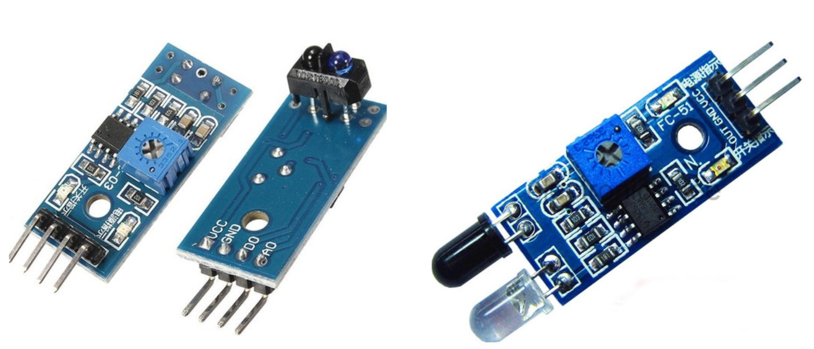
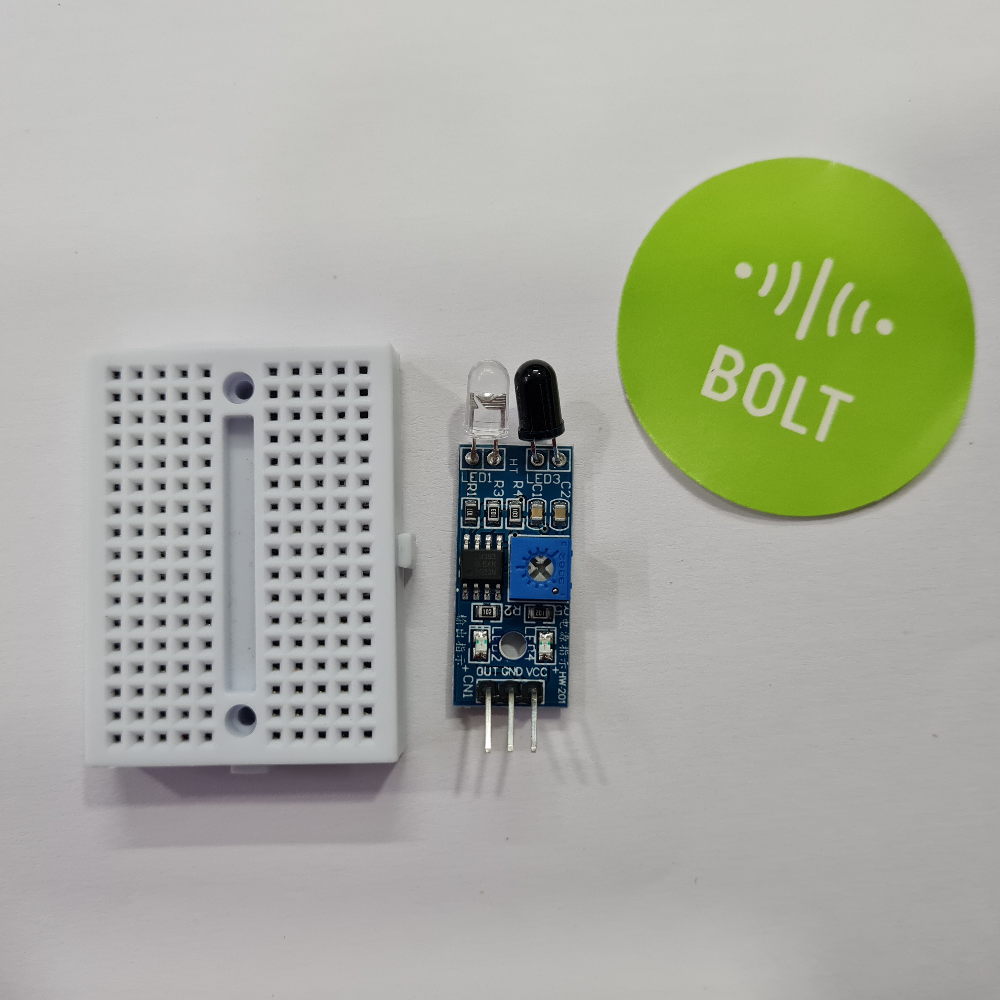
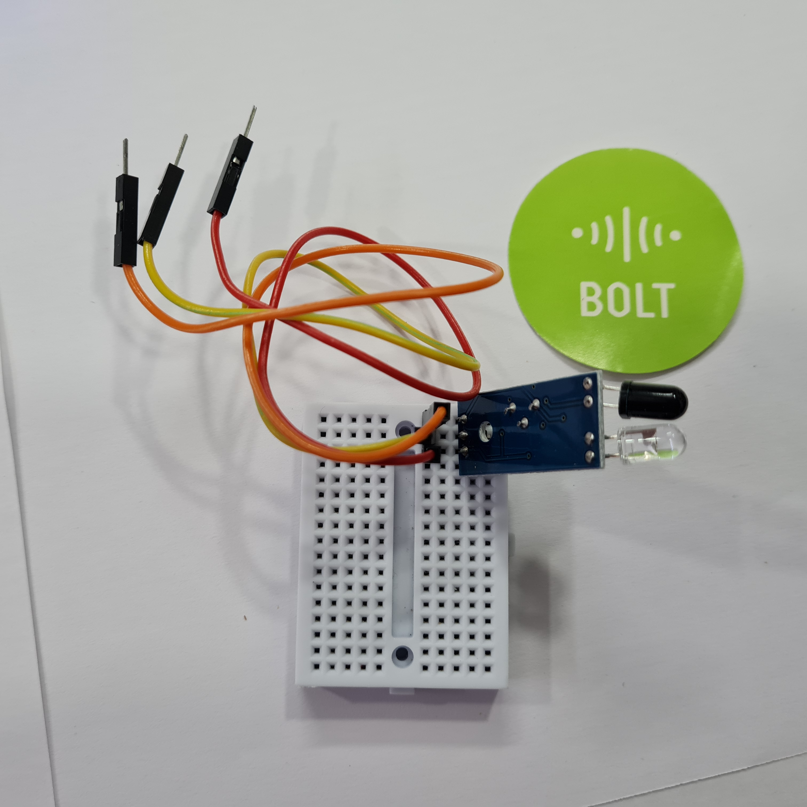
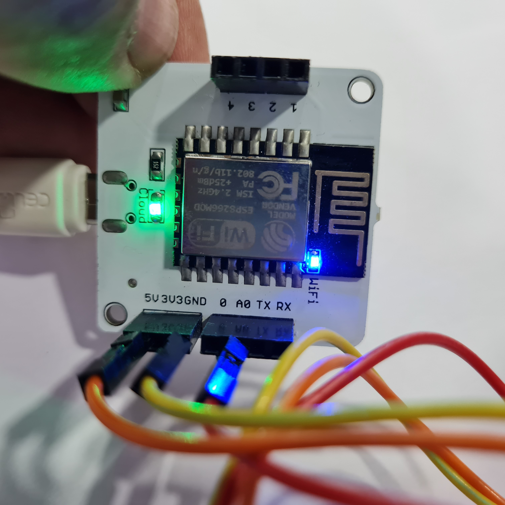
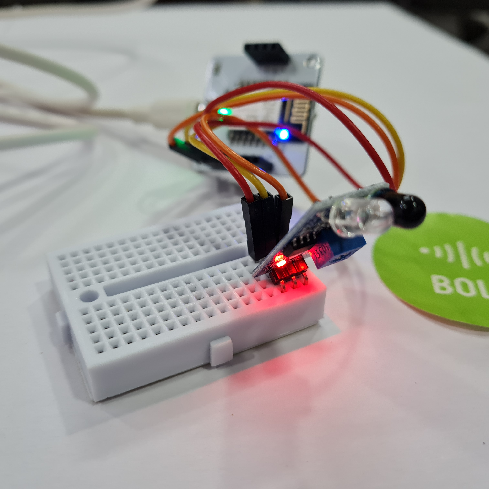
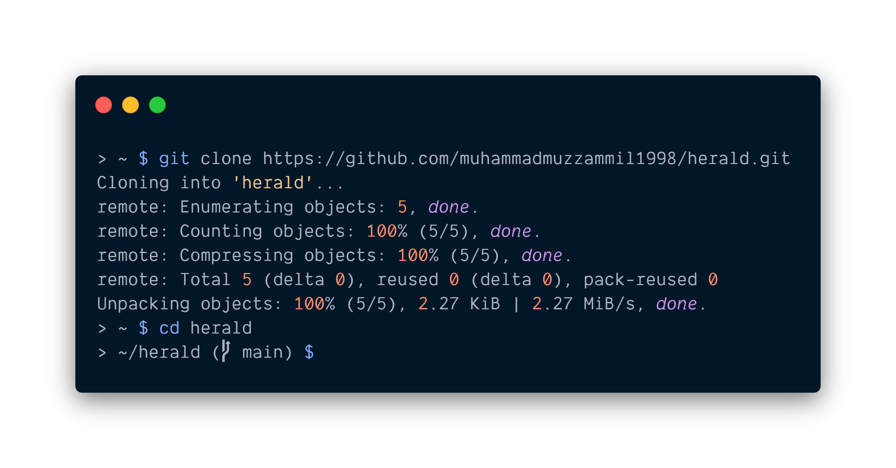
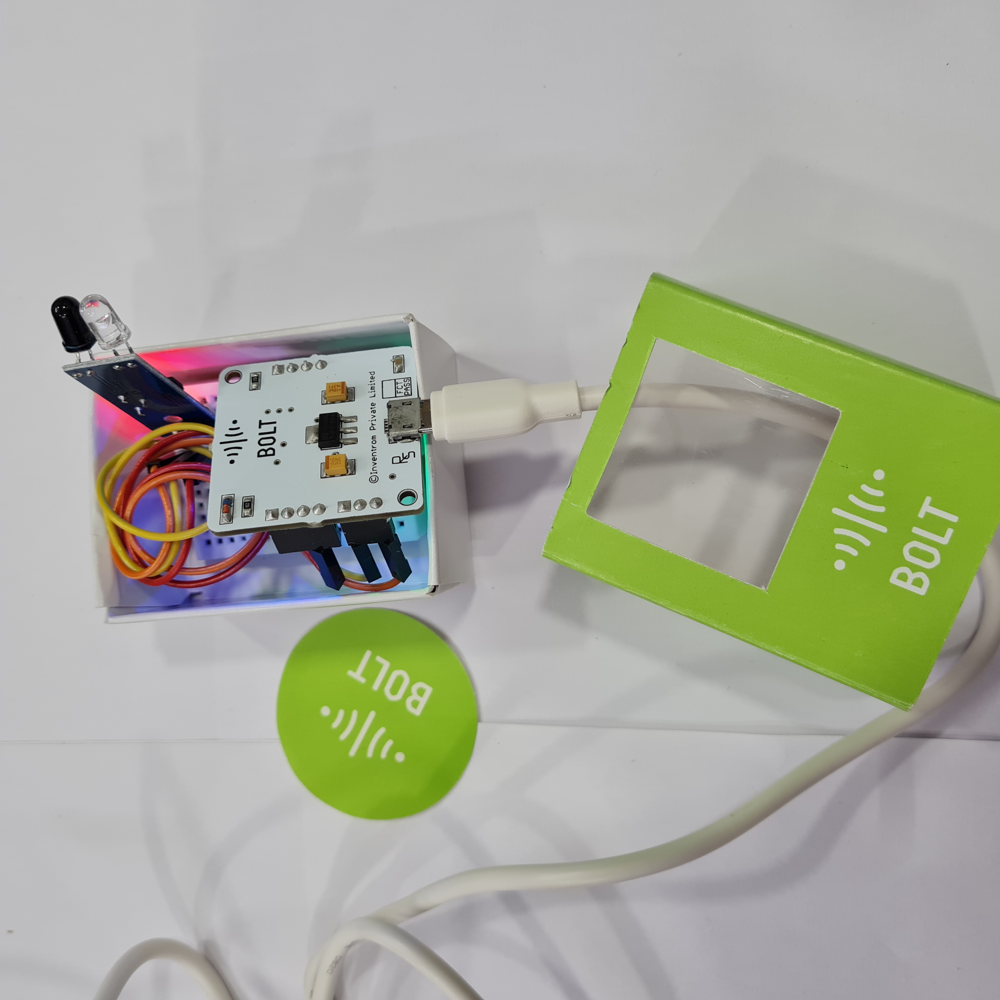
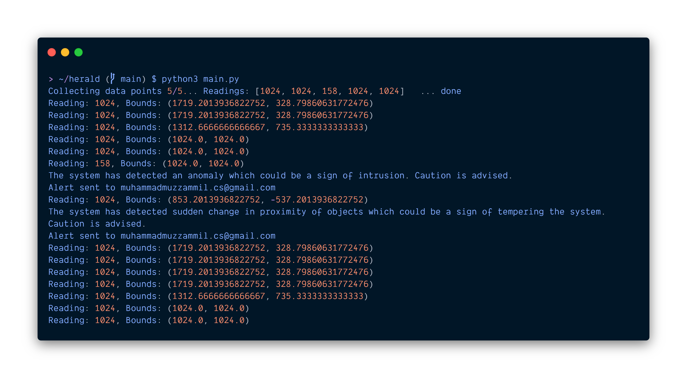
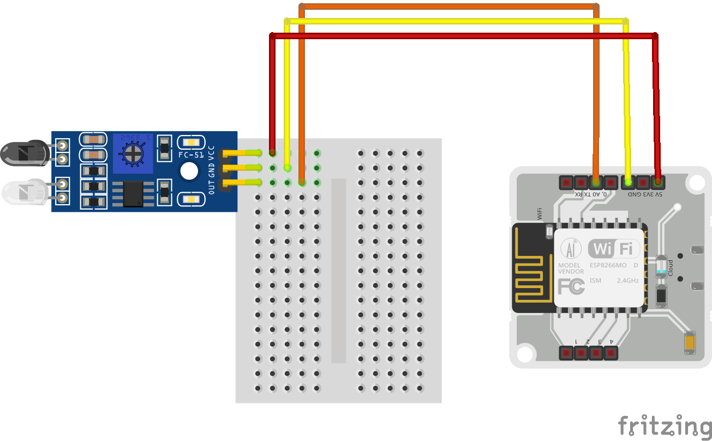

# Herald: Intrusion Detection System using IR and ML

Herald - _noun_; a harbinger of events or things.

## Overview

Herald is an intrusion detection system using infrared radiation and anomaly detection using machine learning and Bolt IoT wifi module. The IoT device makes use of IR sensor and cloud technology for alerting the stakeholders of the detected anomaly.

## Things used in this project


Most of the hardware components can be found in the Bolt IoT starter kit and digital components are relatively inexpensive.

### Hardware Components

- Bolt IoT Wifi Module - 1 unit
- Male-Male jumper wires - 3 units
- Mini Breadboard - 1 unit
- FC-51 or TCRT5000 Infrared Radiation Sensor - 1 unit
- Powerbank capable of providing at least 5V - 1 unit
- USB cable to power the module - 1 unit
- Bolt IoT Starter box (for containing) - 1 unit

### Software/digital requirements

- Python
- Cloud VPS
- SMTP Credentials
- Bolt Cloud Pro Account (for better API rate limit, not required for testing)

## Story

### Introduction

An intrusion detection system monitors an area for malicious activity or privacy violations. These are reported to the person(s) whom it concerns via an alert system. It can protect your home/office by detection intrusion.

Our system utilizes machine learning to adjust the alert parameters and emails the concerned entities via Simple Mail Transfer Protocol.

### FC-51 or TCRT5000. Which one to use?


Both IR sensors are capable to provide valid results for this experiment however, for anomaly detection, the TCRT5000 should work better than FC-51. The reason being that TCRT5000 can provide both analog and digital output depending upon the proximity of the object and the FC-51 sensor can only provide either HIGH or LOW output depending upon the detection and doesn't consider the proximity of the object.

While creating this project, I tried to purchase the TCRT5000 sensor but due to COVID-19 lockdown and restrictions on online shopping, I was unable to purchase it. So, I had to settle with an FC-51 sensor. Ideally, I should have used a TCRT5000.

I have written this and the code with compatibility of both sensors and either can be used without changing the code and connections.

### Procedure

#### Setting up the hardware

Step 1: Connect the sensor to breadboard. This is optional. In case you want to connect the sensor directly to the Bolt IoT Wifi Module, you may do so.



Step 2: Connect the male-male jumper wires to the corresponding pins on the breadboard.



Step 3: Connect the other end of jumper wires to the Bolt module. Connection should match as:

```
Sensor to Bolt Module connections:
VCC <-> 5V
GND <-> GND
OUT <-> A0
```



Step 4: Power on the bolt module via a power bank or direct connection of at least 5V.

Step 5: Verify connectivity on bolt module and connections. The IR sensor should show an LED for power and another LED may light up in case it detects some object in proximity. You may adjust the sensitivity by adjusting the potentiometer.



#### Loading the software

The code is written in the Python language and is coded to be suitable with both types of hardware described above. You will need to install Python which can be done easily (just google it if you don’t have it) and then install the Bolt IoT library via pip.

For deployment purpose, you will need a VPS for hosting the script and SMTP credentials for emailing. You may create a VPS via [DigitalOcean](https://m.do.co/c/c50ea001b767) or AWS and use Gmail credentials for sending emails (you should create a new Gmail account for this instead of using a personal account). However, if you are just trying the project, you may skip these and run on your PC.

Step 1: Log in to your server

Step 2: Assuming you already have python3 installed, run this command to install the Bolt IoT library

```bash
$ pip3 install boltiot
```

Step 3: Clone the git repository containing the code and navigate to it

```bash
$ git clone https://github.com/muhammadmuzzammil1998/herald; cd herald
```



#### Configuring the system

After cloning the repository, you have to edit the configuration file `config.py` as per your own configurations and requirements. The contents of config.py are used in the main code and have description along the line as well.

You might want to adjust the api_limit_margin and api_limit_per_minute as per your bolt account or use the pro account.

```bash
$ nano config.py # To edit the configurations
```

```python
# API and Device configurations #

api_key = ""              #Bolt user API key
device_id = ""            #Bolt device ID
cooldown = 10             #Cooldown after an unsuccessful api call to device in seconds
frame_size = 5            #Frame size for computing z-score
factor = 2                #Factor for computing z-score
api_limit_per_minute = 20 #Ratelimit for the API requests per minute
api_limit_margin = 1      #API calls to leave as margin
interval = 60 / (api_limit_per_minute - api_limit_margin) #Optional edit: Interval for checking status

# Email configurations #

smtp_server = ":587"  #SMTP server with port in format smtp.gmail.com:587
sender_name = "Herald - the intrusion detector" #Sender's name to display
sender_email = ""     #Username for SMTP server
sender_password = ""  #Password for SMTP server
recipients = ""       #Single recipient in string or a list of recipients in array form
```

- api_key: You can obtain it from cloud.boltiot.com
- device_id: Same as cloud.boltiot.com
- cooldown: Time to pause after an unsuccessful api call to device
- frame_size: Used to calculate the boundary for data
- factor: Used for anomaly detection
- api_limit_per_minute: Ratelimit for the API requests per minute
- api_limit_margin: API calls to leave for other stuff
- interval: Automatically calculated as per above two parameters
- smtp_server: Address of your SMTP server with port. We are using TLS encryption with 587 port. Gmail uses smtp.gmail.com:587.
- sender_name: Name to display on email alert
- sender_password: Password for your gmail account
- recipients: Email addresses of the stakeholders who should be informed. Can be string or list of strings.

#### Starting Herald



Ensure that you have correctly connected the pins as VCC to 5V, GND to GND, and OUT to A0.

Type the following command to start the program. Make sure your Bolt module is connected to the internet and cloud, as indicated by the blue and green LEDs on wifi module and LED on the sensor module.

```bash
$ python3 main.python3
```



As you can see from the above output, an alert is sent when bounds changed. The bounds are calculated using Machine Learning so that minor object detection, such as curtain flowing in front, can be handled without triggering a false alert.

Bounds are calculated using z-score analysis for anomaly detection as:


### Code explanation

#### z_score

z_score function takes in the dataset, frame size, and the factor to adjust the boundary of the given curve. It returns the range in which the next data point should fall.

#### sensor_data

sensor_data takes in the pin to read from and returns the value read when successful. In case there is an error, the function also deals with it.

#### verify_dataset

To ensure that we have sufficient data to generate boundaries for anomaly detection.

#### Why read analog instead of digital read?

The reason here for opting for analog is that the, as discussed earlier, I wished to build this with an advanced sensor but could not get my hands on it. Therefore, to be compatible with both sensors, I chose to read analog input.

## Schematics



## Conclusion

To conclude, we built an intrusion detection system using Bolt IoT which was able to sense the presence when passing through. I installed the device in my home and the device was powered by a power bank. It worked and I received emails when passing through the door.
